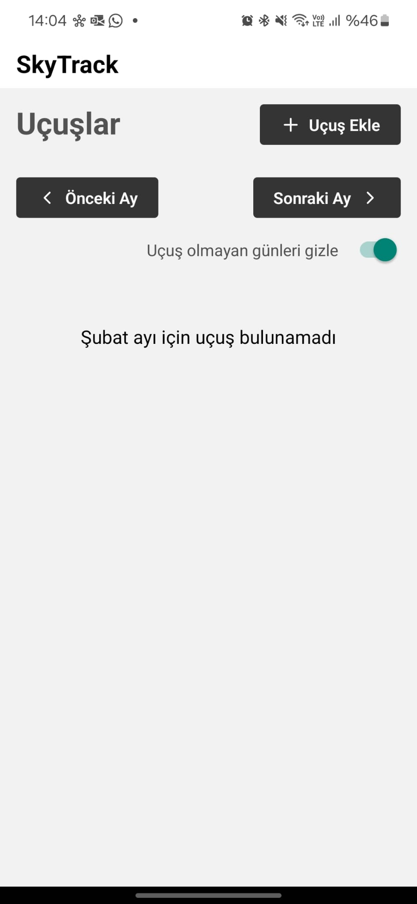
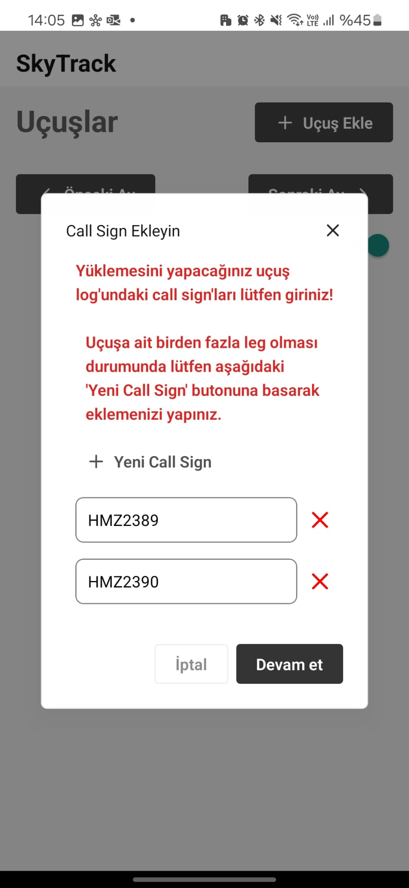
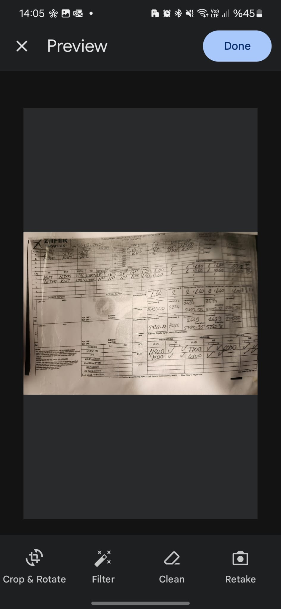
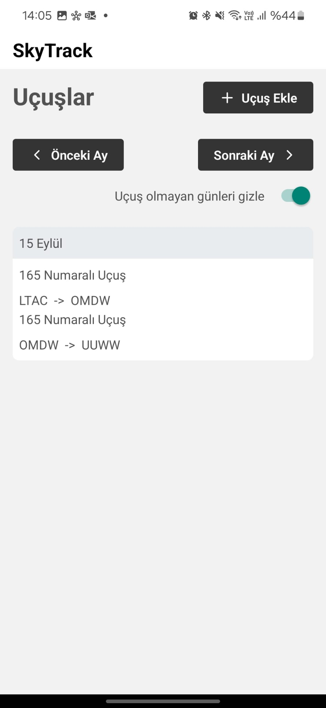
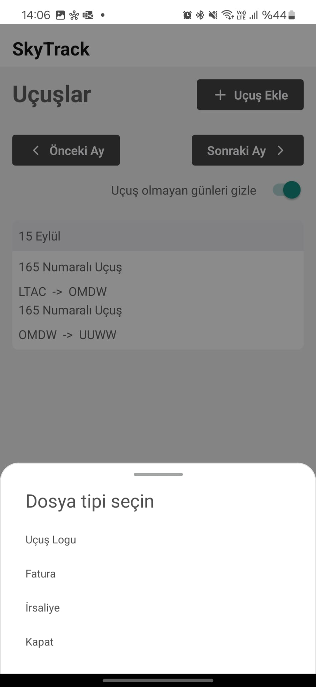

# SkyTrack Mobil Uygulama Kullanım Kılavuzu

## Uçuş Ekleme İşlemi

### 1. Uçuş Oluşturma

- Ana ekranın sağ üst köşesindeki "Uçuş Ekle" butonuna tıklayın
- Açılan menüden "Uçuş Logu" seçeneğini seçin

- "Call Sign Ekleyin" ekranında:
  - Uçuş logundaki her bir bacak (leg) için call sign bilgisini girin
  - Birden fazla bacak varsa "Yeni Call Sign" butonuyla yeni giriş ekleyin
  - Call sign'lar tamamlandığında "Devam et" butonuna tıklayın

### 2. Log Fotoğrafı Yükleme

- Uçuş logunun fotoğrafını çekmek için kamera açılacaktır
- Fotoğraf ekranında şu seçenekler mevcuttur:
  - Crop & Rotate: Fotoğrafı kırpma ve döndürme
  - Filter: Görüntü filtresi uygulama
  - Clean: Görüntüyü temizleme
  - Retake: Yeniden çekme
- Fotoğraf uygun hale geldiğinde "Done" butonuna tıklayın

## Uçuş Takibi ve Belge Yönetimi

### 1. Takvim Görünümü

- Uçuşlar aylık takvim görünümünde listelenir
- "Önceki Ay" ve "Sonraki Ay" butonlarıyla navigasyon yapılabilir
- "Uçuş olmayan günleri gizle" seçeneği ile takvim filtrelenebilir
- Her uçuş, kalkış ve varış noktalarıyla birlikte görüntülenir (Örn: LTAC -> OMDW)

### 2. Belge Ekleme

- Takvimde görünen uçuşa tıklayarak detay ekranına gidin
- "Dosya tipi seçin" menüsünden:
  - Fatura eklemek için "Fatura" seçeneğini
  - İrsaliye eklemek için "İrsaliye" seçeneğini seçin
- İlgili belgenin fotoğrafını çekin veya galeriden seçin

### Önemli Notlar

- Uçuş logu yüklemeden önce call sign girişlerinin doğruluğunu kontrol edin
- Belge fotoğraflarının okunaklı ve tam olmasına dikkat edin
- Fatura ve irsaliyelerin doğru uçuşla eşleştirildiğinden emin olun
- Uçuş takviminde güncel bilgileri görmek için uygulamayı düzenli olarak güncelleyin
