# Web Kullanımı

# Menü Listesi

# Zafer Air Navigasyon Menüsü

Sistem navigasyon menüsü sol tarafta yer alır ve aşağıdaki ana bölümlerden oluşur:

## Ana Bölümler

### Ana Sayfa

Sistemin genel görünümü ve özet bilgilerinin yer aldığı ana ekran.

### Uçaklar

Filo yönetimi ve uçak kayıtlarının tutulduğu bölüm.

### Uçuşlar

- **Tüm Uçuşlar**: Sistemdeki tüm uçuşların listelendiği ekran
- **Uçuş Arama**: Spesifik uçuş kayıtlarına erişim için arama arayüzü

### Faturalar

- **Tüm Faturalar**: Sisteme kaydedilen tüm faturaların görüntülendiği ekran
- **Fatura Arama**: Fatura bazlı arama yapılabilen bölüm

### Masraflar

- **Tüm Masraflar**: Uçuşlara ait masraf kayıtlarının listelendiği ekran
- **Masraf Arama**: Masraf kayıtları içinde arama yapılabilen bölüm

### Yönetim Bölümleri

- **Firmalar**: Firma kayıtlarının yönetildiği ekran
- **Kullanıcılar**: Sistem kullanıcılarının yönetimi
- **Roller**: Kullanıcı yetkilerinin ve rollerinin tanımlandığı bölüm
- **Ayarlar**: Sistem genelinde yapılandırma ayarları
- **Hesaplar**: Finansal hesapların yönetildiği bölüm

Her bölüm kendi içinde ilgili işlevlere sahip alt ekranlar içerir ve kullanıcının yetki seviyesine göre erişilebilir durumdadır.

## Uçak Menüsü

### Ana Uçak Listesi Ekranı

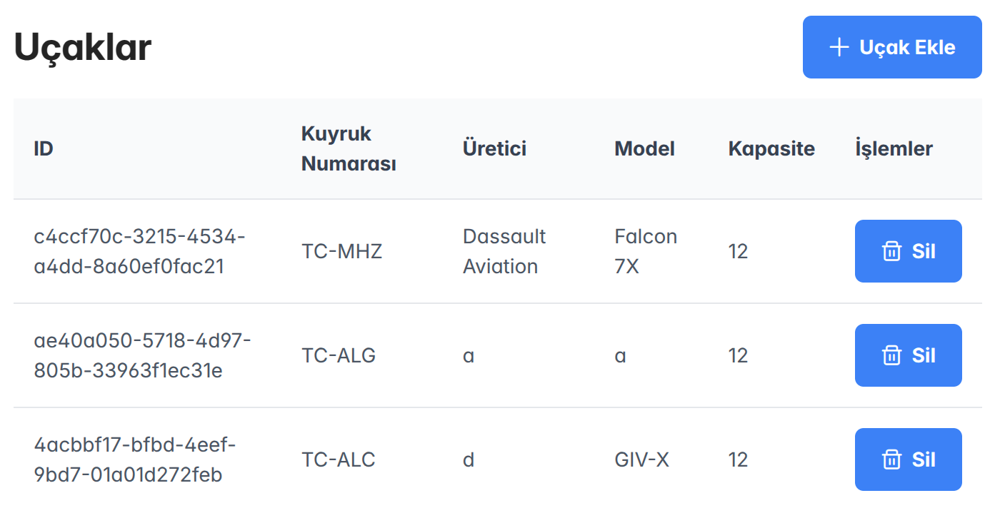

- Ekranın sağ üst köşesinde yer alan mavi "Uçak Ekle" butonu ile yeni uçak ekleme formuna erişilir
- Mevcut uçaklar liste halinde görüntülenir ve her uçak için:
  - ID (sistem tarafından otomatik atanan benzersiz tanımlayıcı)
  - Kuyruk Numarası (örn: TC-MHZ)
  - Üretici (örn: Dassault Aviation)
  - Model (örn: Falcon 7X)
  - Kapasite (yolcu kapasitesi)
  - İşlemler (silme vb. işlemler için)
    bilgileri görüntülenir

### Uçak Ekleme Formu

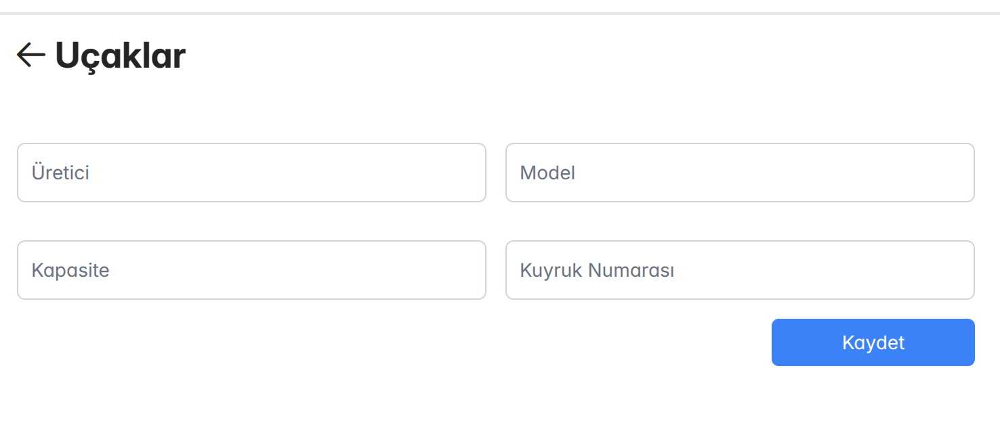

Yeni uçak eklemek için doldurulması gereken form alanları:

- Üretici: Uçağın üretici firması
- Model: Uçağın model bilgisi
- Kapasite: Uçağın yolcu kapasitesi
- Kuyruk Numarası: Uçağın resmi kayıt numarası (TC ile başlayan kod)

Form doldurulduktan sonra alt kısımda yer alan mavi "Kaydet" butonu ile yeni uçak kaydı tamamlanır. Başarılı kayıt sonrası kullanıcı ana listeye yönlendirilir ve yeni eklenen uçak listede görüntülenir.

Form alanlarının tümü zorunlu olup, eksik bilgi girilmesi durumunda kullanıcıya uyarı mesajı gösterilir. Kuyruk numarası alanına girilen değer benzersiz olmalıdır, mevcut bir kuyruk numarası tekrar kullanılamaz.

## Uçuş Menüsü

# Uçuş Yönetimi Ekranı

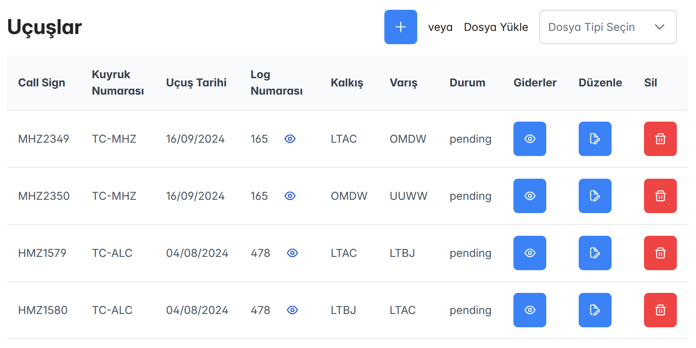

## Genel Görünüm

Uçuş yönetimi ekranı, tüm uçuşların listelendiği ve yönetildiği ana ekrandır. Ekranın üst kısmında iki farklı yöntemle yeni uçuş ekleme seçeneği sunulmaktadır:

- "+" butonu ile manuel uçuş girişi
- "Dosya Yükle" seçeneği ile toplu uçuş verisi yükleme

## Liste Görünümü

Uçuşlar aşağıdaki kolonlar halinde listelenir:

### Ana Bilgiler

- **Call Sign**: Uçuş çağrı kodu (Örn: MHZ2349)
- **Kuyruk Numarası**: Uçağın tescil numarası (Örn: TC-MHZ)
- **Uçuş Tarihi**: Uçuşun gerçekleştiği tarih
- **Log Numarası**: Teknik log kayıt numarası
- **Kalkış**: Kalkış havaalanı kodu (Örn: LTAC)
- **Varış**: Varış havaalanı kodu (Örn: OMDW)
- **Durum**: Uçuşun mevcut durumu (Örn: pending)

### İşlem Butonları

Her uçuş kaydı için sağ tarafta üç işlem butonu bulunur:

- **Görüntüle** (👁️): Uçuş detaylarını görüntüleme
- **Düzenle** (🖊️): Uçuş bilgilerini düzenleme
- **Sil** (🗑️): Uçuş kaydını silme

## Özel Özellikler

- Log numaralarının yanındaki göz ikonu (👁️) ile ilgili log dosyasına hızlı erişim sağlanır
- Durum kolonu uçuşun işlem sürecindeki aşamasını gösterir (pending, completed vb.)
- Liste görünümü sayfalandırılmış olup, kullanıcılar sayfalar arasında gezinebilir
- Kolonlara göre sıralama ve filtreleme yapılabilir

## Veri Yükleme

"Dosya Yükle" seçeneği ile:

- Teknik log dosyaları sisteme yüklenebilir
- OCR teknolojisi ile dosya içeriği otomatik olarak işlenir
- Toplu uçuş verisi sisteme aktarılır

# Uçuş Arama ve Detay Ekranı

Ekran iki ana bölümden oluşmaktadır: sol tarafta filtreleme alanı ve sağ tarafta seçili uçuşun detay bilgileri yer almaktadır.

## Filtreleme Bölümü

### Filtre Seçenekleri

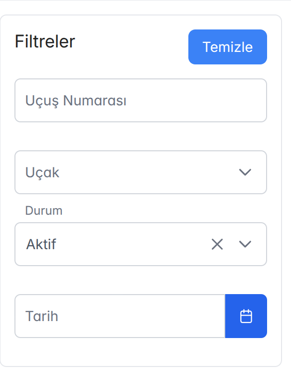

- **Uçuş Numarası**: Belirli bir uçuş numarasına göre arama
- **Uçak**: Dropdown menüden uçak seçimi
- **Durum**: Uçuşun durumuna göre filtreleme (Aktif, Beklemede vb.)
- **Tarih**: Tarih aralığına göre filtreleme
- **Temizle**: Tüm filtreleri sıfırlama butonu

### Sonuç Listesi

- Filtrelere uyan uçuşlar alt kısımda liste halinde gösterilir
- Her uçuş kaydı ayrı bir satırda görüntülenir
- Uçuş numarası ile birlikte gösterilir (Örn: "165 Numaralı Uçuş")

## Uçuş Detay Bölümü

### Temel Bilgiler

- **Uçuş Numarası**: Teknik log numarası
- **Call Sign**: Uçuş çağrı kodu
- **LogSheet No**: Log sayfası numarası
- **Kaptan**: Sorumlu kaptan pilot
- **First Officer**: Yardımcı pilot
- **Yolcu**: Yolcu bilgileri
- **Observer**: Gözlemci bilgisi
- **De-Icing**: Buz çözme işlemi bilgisi
- **Uçak Tipi**: Uçağın modeli
- **Belge Tarihi**: Uçuş belgesi tarihi
- **İmza/Damga Tarihi**: Resmi onay tarihi
- **Durum**: Uçuşun mevcut durumu

### Uçuş Detayları

- **PF/PNF**: Pilot Flying/Pilot Not Flying bilgileri
- **From/To**: Kalkış ve varış noktaları
- **Off Block/On Block**: Uçağın park yerinden ayrılış ve varış zamanları
- **Takeoff/Landing**: Kalkış ve iniş zamanları
- **Block Hours**: Toplam blok süresi
- **Flight Time**: Uçuş süresi
- **Landings**: İniş sayısı
- **Remarks**: Özel notlar

Tüm tarih ve saat seçimleri için takvim/saat seçici bileşenleri kullanılmıştır. Sistem arayüzü kullanıcı dostu olup, kolay navigasyon sağlamaktadır.

# Faturalar Ekranı

## Genel Bakış

Faturalar ekranı, sistemdeki tüm uçuş operasyonlarına ait faturaların listelendiği ve yönetildiği bölümdür. Ekranın sağ üst köşesinde "Fatura Ekle" butonu ile yeni fatura girişi yapılabilmektedir.

## Liste Görünümü

Faturalar aşağıdaki kolonlar halinde listelenir:

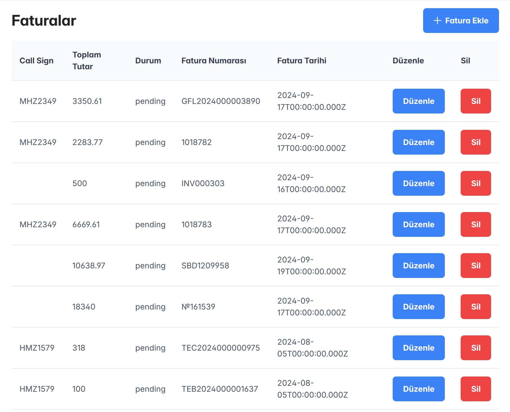

### Temel Bilgiler

- **Call Sign**: Uçuş çağrı kodu (Örn: MHZ2349, HMZ1579)
- **Toplam Tutar**: Faturanın toplam tutarı (Örn: 3350.61, 2283.77)
- **Durum**: Faturanın işlem durumu (Örn: pending)
- **Fatura Numarası**: Benzersiz fatura tanımlama numarası (Örn: GFL2024000003890, INV000303)
- **Fatura Tarihi**: Faturanın düzenlenme tarihi

### İşlem Butonları

Her fatura kaydı için sağ tarafta iki işlem butonu bulunur:

- **Düzenle**: Mavi renkli buton, fatura bilgilerini düzenleme imkanı sağlar
- **Sil**: Kırmızı renkli buton, fatura kaydını silme işlemi yapar

## Özellikler

- Faturalar tarih sırasına göre listelenir
- Her faturanın benzersiz bir numarası vardır
- Durumu "pending" olan faturalar işlem bekleyen faturaları gösterir
- Aynı uçuşa (Call Sign) ait birden fazla fatura olabilir
- Sistem otomatik olarak toplam tutarları gösterir
- Fatura tarihleri UTC formatında gösterilmektedir

## Güvenlik

- Fatura silme işlemi için kullanıcı onayı gereklidir
- Düzenleme ve silme işlemleri yetki seviyesine göre kısıtlanabilir
- Her işlem sistem tarafından loglanır

# Fatura Arama ve Detay Ekranı

Ekran iki ana bölümden oluşmaktadır: sol tarafta filtreleme alanı ve sağ tarafta seçili faturanın detay bilgileri yer almaktadır.

## Filtreleme Bölümü

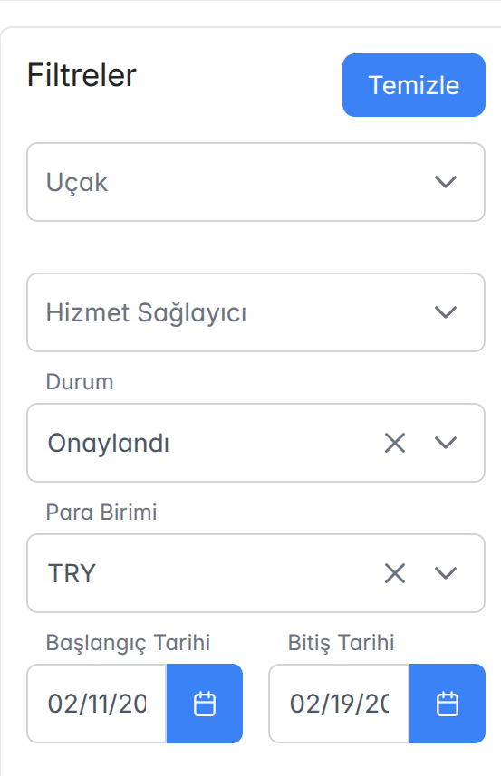

### Filtre Kriterleri

- **Uçak**: Dropdown menüden spesifik uçak seçimi
- **Hizmet Sağlayıcı**: Hizmet veren firma seçimi
- **Durum**: Fatura durumu seçimi (Onaylandı, Pending vb.)
- **Para Birimi**: İşlem para birimi seçimi
- **Başlangıç/Bitiş Tarihi**: Tarih aralığı seçimi için takvim bileşenleri
- **Temizle**: Tüm filtreleri sıfırlama butonu

### Filtrelenmiş Fatura Listesi

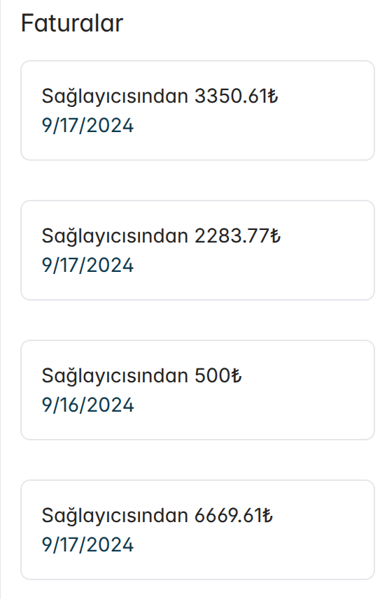

- Filtrelere uyan faturalar alt kısımda listelenir
- Her fatura kaydında:
  - Hizmet sağlayıcı bilgisi
  - Tutar
  - Tarih bilgisi gösterilir

## Fatura Detay Bölümü

### Temel Bilgiler

- **Fatura Numarası**: Benzersiz fatura tanımlayıcısı
- **Servis Sağlayıcı**: Hizmet veren firma bilgisi
- **Toplam Tutar**: Faturanın toplam tutarı
- **Durum**: Faturanın mevcut durumu

### Fatura Detayları

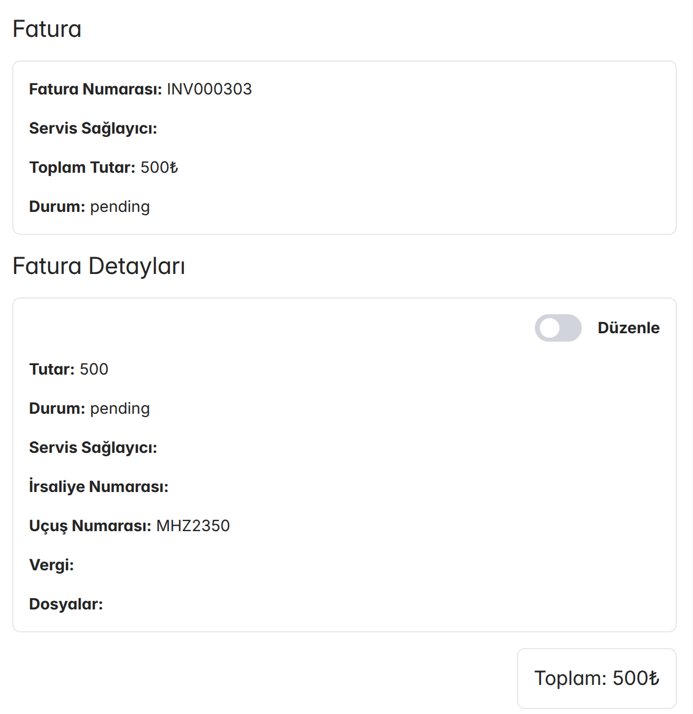

- **Tutar**: İşlem tutarı
- **Durum**: İşlem durumu
- **Servis Sağlayıcı**: Hizmet sağlayıcı detayları
- **İrsaliye Numarası**: Varsa ilişkili irsaliye bilgisi
- **Uçuş Numarası**: İlişkili uçuş kaydı
- **Vergi**: Vergi bilgileri
- **Dosyalar**: Faturaya ait ek belgeler

### İşlem Özellikleri

- Sağ üst köşede "Düzenle" toggle butonu
- Alt kısımda toplam tutar özeti
- Dosya ekleme ve görüntüleme imkanı

Arayüz, kullanıcı dostu tasarımı ile kolay navigasyon ve hızlı filtreleme imkanı sağlamaktadır.

# Giderler (Masraflar) Ekranı

## Genel Bakış

Giderler ekranı, uçuşlara ait tüm masrafların listelendiği ve yönetildiği bir arayüz sunar. Ekranın üst kısmında iki temel işlem butonu bulunur:

- **Dosya Seçin**: Toplu masraf girişi için dosya yükleme
- **Gider Ekle**: Tekil masraf kaydı oluşturma

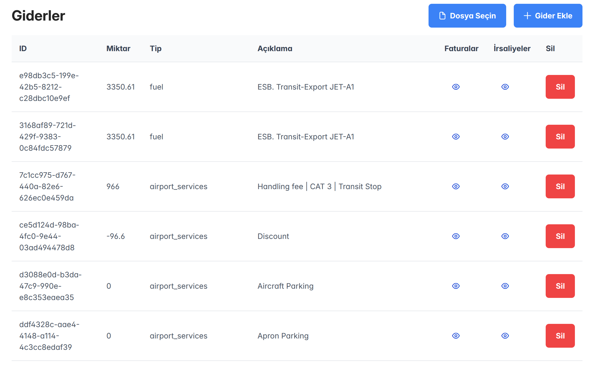

## Liste Görünümü

Masraflar aşağıdaki kolonlar halinde listelenir:

### Ana Kolonlar

- **ID**: Sistem tarafından atanan benzersiz tanımlayıcı
- **Miktar**: Masraf tutarı (Örn: 3350.61, 966, -96.6)
- **Tip**: Masraf kategorisi
  - fuel: Yakıt masrafları
  - airport_services: Havaalanı hizmet bedelleri
- **Açıklama**: Masraf detayı (Örn: "ESB. Transit-Export JET-A1", "Handling fee | CAT 3 | Transit Stop")

### İşlem Kolonları

Her masraf kaydı için üç işlem seçeneği:

- **Faturalar**: İlişkili faturaları görüntüleme (göz ikonu)
- **İrsaliyeler**: İlişkili irsaliyeleri görüntüleme (göz ikonu)
- **Sil**: Masraf kaydını silme (kırmızı buton)

## Özellikler

- Negatif tutarlar indirim olarak gösterilir (Örn: -96.6)
- Masraflar kategorilere ayrılmıştır (fuel, airport_services)
- Her masraf için detaylı açıklama alanı mevcuttur
- Fatura ve irsaliye ilişkilendirmesi yapılabilir
- Toplu veya tekil masraf girişi yapılabilir

## Özel Durumlar

- "0" tutarlı masraflar (Örn: Aircraft Parking, Apron Parking) sistem tarafından takip edilir
- İndirimler negatif tutar olarak gösterilir
- Her masraf kaydı için benzersiz bir ID oluşturulur

# Masraf Arama ve Detay Ekranı

## Genel Bakış

Ekran iki ana bölümden oluşmaktadır: sol tarafta filtreleme alanı ve sağ tarafta seçili masrafın detay bilgileri yer almaktadır.

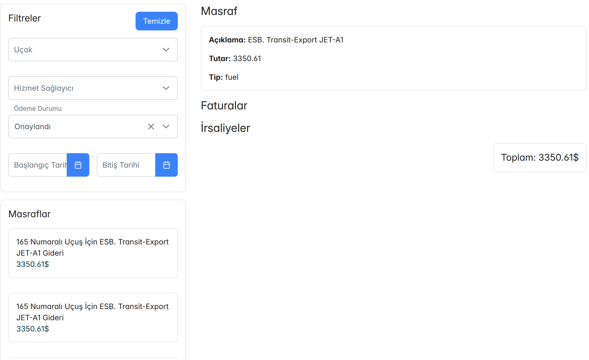

## Filtreleme Bölümü

### Filtre Kriterleri

- **Uçak**: Dropdown menüden spesifik uçak seçimi
- **Hizmet Sağlayıcı**: Hizmet veren firma seçimi
- **Ödeme Durumu**: Masrafın onay durumu (Onaylandı vb.)
- **Başlangıç/Bitiş Tarihi**: Tarih aralığı seçimi için takvim bileşenleri
- **Temizle**: Tüm filtreleri sıfırlama butonu

### Filtrelenmiş Masraf Listesi

- Filtrelere uyan masraflar alt kısımda listelenir
- Her masraf kaydında:
  - Uçuş numarası
  - Masraf açıklaması
  - Tutar bilgisi gösterilir
  - Örnek: "165 Numaralı Uçuş İçin ESB. Transit-Export JET-A1 Gideri 3350.61$"

## Masraf Detay Bölümü

### Temel Bilgiler

- **Açıklama**: Masrafın detaylı açıklaması (Örn: ESB. Transit-Export JET-A1)
- **Tutar**: Masraf tutarı
- **Tip**: Masraf kategorisi (Örn: fuel)

### İlişkili Belgeler

- **Faturalar**: Masrafa ait fatura kayıtları
- **İrsaliyeler**: Masrafa ait irsaliye kayıtları

### Özet Bilgisi

- Sağ alt köşede toplam tutar özeti görüntülenir (Örn: Toplam: 3350.61$)

Arayüz, kullanıcıların masrafları kolayca filtreleyip bulmasını ve detaylarını incelemesini sağlayan kullanıcı dostu bir tasarıma sahiptir.

# Firmalar Yönetim Ekranı

## Genel Bakış

Firmalar ekranı iki temel firma tipini yönetmek için tasarlanmıştır:

1. Sahip Olunan Firmalar: Sistemin asıl kullanıcısı olan havacılık şirketleri
2. Hizmet Sağlayıcı Firmalar: Hizmet/ürün tedarik eden dış firmalar

## Ana Liste Görünümü

Ekranın üst kısmında "Firma Ekle" butonu ve ana listede aşağıdaki kolonlar bulunur:

- **ID**: Sistem tarafından atanan benzersiz tanımlayıcı
- **İsim**: Firma adı
- **Şirket Tipi**: Firma kategorisi (Sahip Olunan Firma / Hizmet Sağlayıcı)
- **İşlemler**: Firma kaydını silme seçeneği

## Firma Ekleme Formu

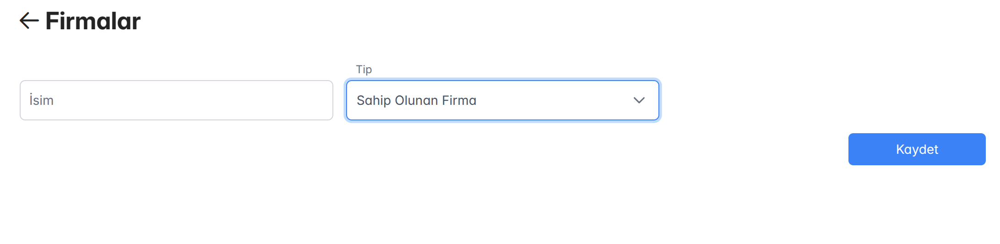

Yeni firma kaydı oluşturmak için gereken alanlar:

- **İsim**: Firma adı girişi
- **Tip**: Firma tipinin seçimi (dropdown menüden)
  - Sahip Olunan Firma
  - Hizmet Sağlayıcı
- **Kaydet**: Firma bilgilerini kaydetme butonu

## Firma Tipleri ve Özellikleri

### Sahip Olunan Firmalar

- Ana kullanıcı firmaları temsil eder
- Bu firmalara ait:
  - Masraflar
  - Faturalar
  - Finansal işlemler
    kendi hesaplarında takip edilir
- Her bir sahip olunan firma için ayrı muhasebe kaydı tutulur

### Hizmet Sağlayıcı Firmalar

- Dış tedarikçileri temsil eder
- Bu firmalar:
  - Fatura kesebilir
  - İrsaliye gönderebilir
  - Hizmet/ürün tedarik edebilir
- Sistemde bu firmalardan alınan hizmetler ve ürünler takip edilir

## Güvenlik ve Yetkilendirme

- Firma silme işlemi için onay gerekir
- Sahip olunan firma ekleme yetkisi sınırlıdır
- Her işlem sistem tarafından loglanır

# Kullanıcı Yönetimi Ekranları

## Ana Kullanıcı Listesi Ekranı

### Filtreleme Bölümü

- **İsim**: Kullanıcı adına göre arama yapma
- **Sıfırla**: Uygulanan filtreleri temizleme
- Sol panelde mevcut kullanıcıların listesi görüntülenir:
  - Kullanıcı adı
  - E-posta adresi
  - Alt kısımda toplam kullanıcı sayısı

### Kullanıcı Detayları ve Yönetim

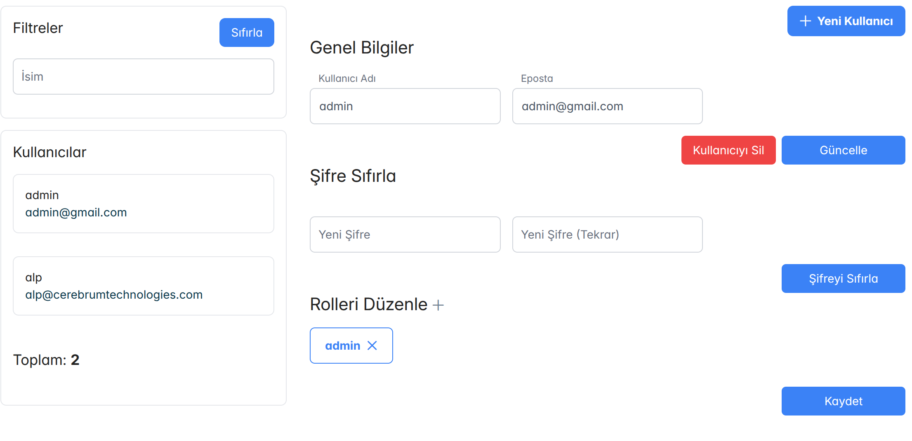

#### Genel Bilgiler

- **Kullanıcı Adı**: Sisteme giriş için kullanılan isim
- **Eposta**: Kullanıcının e-posta adresi
- İşlem butonları:
  - "Kullanıcıyı Sil" (kırmızı buton)
  - "Güncelle" (mavi buton)

#### Şifre Yönetimi

- **Şifre Sıfırla** bölümü:
  - Yeni Şifre girişi
  - Yeni Şifre (Tekrar) doğrulama
  - "Şifreyi Sıfırla" butonu

#### Rol Yönetimi

- **Rolleri Düzenle** bölümü:
  - Mevcut rollerin gösterimi (örn: admin)
  - Rol ekleme/çıkarma imkanı
  - "+" butonu ile yeni rol ekleme

## Yeni Kullanıcı Ekleme Ekranı

Sağ üst köşedeki "Yeni Kullanıcı" butonu ile açılır:

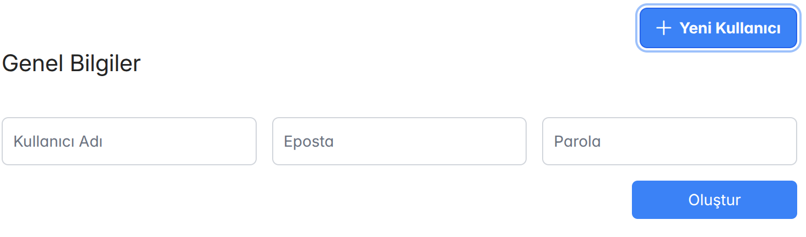

### Gerekli Bilgiler

- **Kullanıcı Adı**: Sistemde kullanılacak isim
- **Eposta**: İletişim ve giriş için e-posta
- **Parola**: Güvenli şifre oluşturma
- "Oluştur" butonu ile kayıt tamamlanır

### Güvenlik Özellikleri

- Şifre gereksinimleri kontrol edilir
- E-posta formatı doğrulanır
- Benzersiz kullanıcı adı zorunluluğu
- Rol bazlı yetkilendirme sistemi

Bu ekranlar aracılığıyla sistem yöneticileri, kullanıcıları etkin bir şekilde yönetebilir, yeni kullanıcılar ekleyebilir ve mevcut kullanıcıların yetkilerini düzenleyebilir.

# Roller (Yetkilendirme) Yönetimi

## Genel Bakış

Roller ekranı, sistem kullanıcılarına atanacak yetkilerin ve izinlerin yönetildiği bölümdür. Ekran, rol listeleme ve rol oluşturma/düzenleme olmak üzere iki ana bölümden oluşur.

## Rol Listesi Ekranı

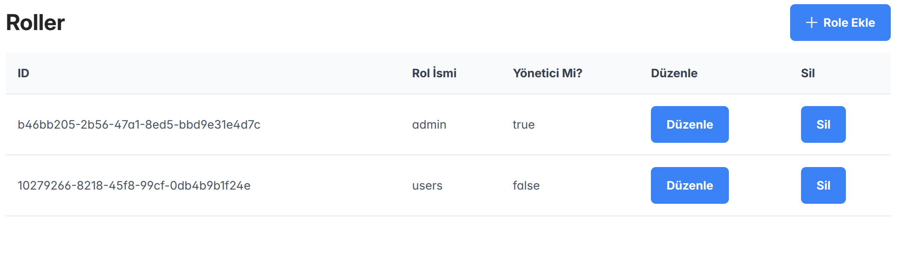

### Liste Kolonları

- **ID**: Benzersiz rol tanımlayıcısı
- **Rol İsmi**: Rolün adı (örn: admin, users)
- **Yönetici Mi?**: Rolün yönetici yetkisine sahip olup olmadığı (true/false)
- **İşlem Butonları**:
  - Düzenle: Rol ayarlarını değiştirme
  - Sil: Rolü sistemden kaldırma

### "Role Ekle" Butonu

Sağ üst köşede yeni rol oluşturmak için kullanılır

## Rol Oluşturma/Düzenleme Ekranı

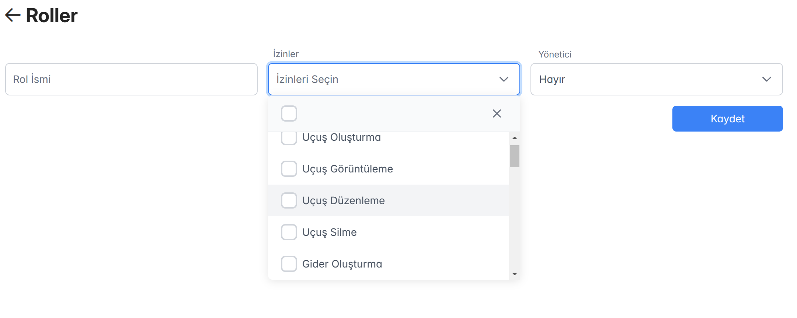

### Temel Bilgiler

- **Rol İsmi**: Rolü tanımlayan benzersiz isim
- **İzinler**: Rol için tanımlanacak yetkilerin seçimi
- **Yönetici**: Rolün yönetici yetkisine sahip olup olmadığı

### İzin Seçenekleri

Çoklu seçim yapılabilen izin listesi:

- Uçuş Oluşturma
- Uçuş Görüntüleme
- Uçuş Düzenleme
- Uçuş Silme
- Gider Oluşturma
- ve diğer sistem izinleri...

### İşlem Butonları

- **Kaydet**: Rol ayarlarını kaydeder
- **İptal**: Değişiklikleri iptal eder

## Güvenlik Özellikleri

- Yönetici rolüne sahip kullanıcılar tüm yetkilere sahiptir
- Rol silme işlemi için yönetici yetkisi gereklidir
- Sistem rolleri (admin gibi) silinemez
- Her rol değişikliği loglanır

Bu sistem sayesinde kullanıcılara görev ve sorumluluklarına uygun yetkiler atanabilir ve sistem güvenliği granüler bir şekilde yönetilebilir.

# Bildirimler Sistemi

## Genel Bakış

Sistemin sağ üst köşesinde yer alan çan ikonu, kullanıcıları yeni eklenen belgeler ve kontrol gerektiren işlemler hakkında bilgilendirir. İkon üzerindeki kırmızı rozet (örn: "3"), bekleyen bildirimlerin sayısını gösterir.

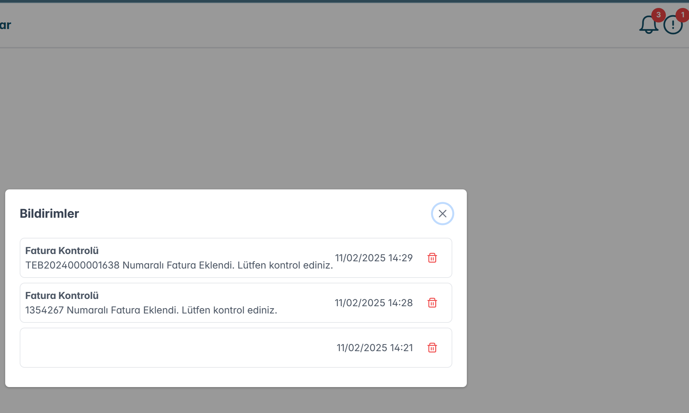

## Bildirim Tipleri

### Fatura Kontrolleri

- Yeni eklenen faturaların kontrol edilmesi için bildirimler oluşturulur
- Bildirimde fatura numarası ve eklenme zamanı gösterilir
- Örnek: "TEB2024000001638 Numaralı Fatura Eklendi. Lütfen kontrol ediniz."

### Uçuş Log Kontrolleri

- Sisteme yüklenen uçuş logları için bildirim oluşturulur
- Kullanıcının OCR sonuçlarını kontrol etmesi gerektiğini belirtir

### İrsaliye Kontrolleri

- Yeni eklenen irsaliyelerin kontrol edilmesi için bildirimler oluşturulur
- İrsaliye detayları ve eklenme zamanı gösterilir

## Bildirim Özellikleri

- Her bildirimde tarih ve saat bilgisi yer alır
- Bildirimlerin sağ tarafında çöp kutusu ikonu ile silme imkanı
- Bildirimler kronolojik sırayla listelenir
- Bildirim paneli sağ üst köşedeki "X" ile kapatılabilir

## İş Akışı

1. Yeni bir belge sisteme eklendiğinde otomatik bildirim oluşturulur
2. Kullanıcı bildirimi görür ve ilgili belgeyi kontrol eder
3. Kontrol sonrası belge onaylanır veya reddedilir
4. İşlem tamamlandığında bildirim silinebilir

Bu sistem sayesinde kullanıcılar, kontrol edilmesi gereken yeni belgeleri kolayca takip edebilir ve veri doğruluğunu sağlayabilir.

# Mükerrer Fatura Kontrol Sistemi

## Genel Bakış

Sağ üst köşede yer alan ünlem ikonu (⚠️), sistemin tespit ettiği potansiyel mükerrer faturaları gösterir. Yapay zeka modeli, çeşitli kriterlere dayanarak mükerrer olabilecek faturaları işaretler ve kullanıcının incelemesi için sunar.

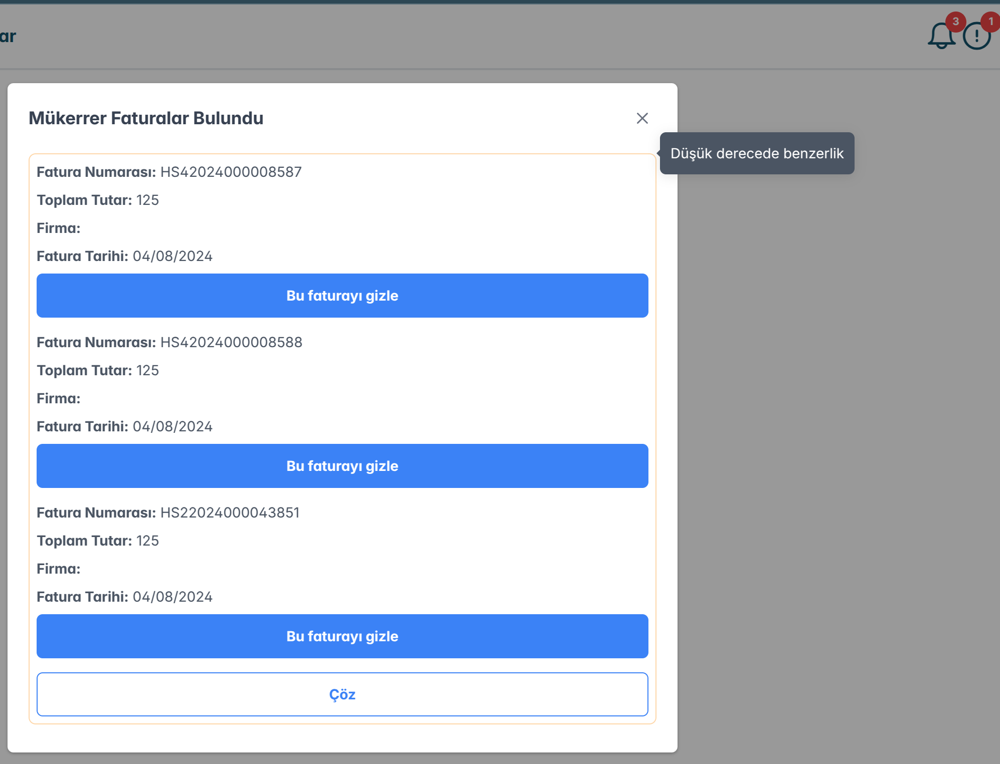

## Mükerrerlik Kriterleri

Sistem aşağıdaki kriterleri kullanarak faturaların mükerrer olma olasılığını değerlendirir:

- Fatura numarası benzerliği
- İrsaliye numarası eşleşmesi
- Fatura tarihi yakınlığı
- Fatura tutarı benzerliği

## Kullanıcı Arayüzü Özellikleri

### Hover Bilgi Gösterimi

- Fare imleci fatura üzerine getirildiğinde (hover):
  - Yapay zeka modelinin mükerrerlik değerlendirmesi
  - Hangi kriterlerde benzerlik tespit edildiği
  - Benzerlik oranları görüntülenir

### İşlem Butonları

1. **Gizle Butonu**

   - Faturanın mükerrer olduğu onaylanır
   - Fatura sistemde gizli olarak işaretlenir
   - Raporlamalarda mükerrer olarak gösterilir

2. **Çöz Butonu**
   - Faturanın mükerrer olmadığı onaylanır
   - Fatura normal işlem sürecine devam eder
   - Sistem gelecekte benzer faturaları mükerrer olarak işaretlemek için bu kararı öğrenir

## İş Akışı

1. Sistem mükerrer olabilecek faturaları tespit eder
2. Kullanıcıya ünlem ikonu ile bildirim gösterilir
3. Kullanıcı fare ile fatura üzerine gelerek detaylı analizi görür
4. Kullanıcı inceleme sonrası "Gizle" veya "Çöz" kararı verir
5. Sistem kararı kaydeder ve gelecekteki tespitler için kullanır

Bu sistem sayesinde mükerrer fatura ödemeleri önlenir ve faturaların doğru şekilde işlenmesi sağlanır.

# Belge Düzenleme Ayarları

## Genel Bakış

Ayarlar menüsü üç temel belge tipinin OCR ayarlarını yönetmek için tasarlanmıştır:

1. Uçuş Logu Düzenleme
2. Fatura Düzenleme
3. İrsaliye Düzenleme

Her ekran için özelleştirilebilir alan tanımlamaları yapılabilmektedir.

## Alan Tanımlama Yapısı

Her alan için aşağıdaki bilgiler belirlenir:

- **Key**: OCR sonrası verinin atanacağı sistem değişkeni
- **İsim**: Alanın kullanıcı arayüzündeki görünen adı
- **Placeholder**: Form alanında görünecek örnek değer
- **Tip**: Veri tipi (Sayı, Metin vb.)

## Belge Tipleri ve Özel Alanları

### 1. Uçuş Logu Düzenleme

Örnek alanlar:

- `no`: Uçuş log numarası
- `planeTailNo`: Uçak kuyruk numarası
  Uçuşa ait temel bilgilerin OCR ile toplanacağı alanlar tanımlanır.

### 2. Fatura Düzenleme

Örnek alanlar:

- `airport`: Havaalanı bilgisi
- `language`: Fatura dili
  Faturadan çıkarılacak finansal ve operasyonel bilgiler için alan tanımları yapılır.

### 3. İrsaliye Düzenleme

Örnek alanlar:

- `callSign`: Uçuş çağrı kodu
- `departure`: Kalkış bilgisi
  İrsaliyelerden alınacak teslimat ve operasyon bilgileri için alan tanımları yapılır.

## Ortak Özellikler

- "Alan Ekle" butonu ile yeni alan tanımı yapılabilir
- Her alan için "Sil" butonu ile tanım kaldırılabilir
- Yapılan değişiklikler sistem genelinde OCR işlemlerini etkiler
- Alanlar sürükle-bırak ile sıralanabilir

Bu ayarlar sayesinde, OCR sistemi belgelerdeki önemli bilgileri doğru şekilde tanıyıp ilgili sistem alanlarına atayabilir.
